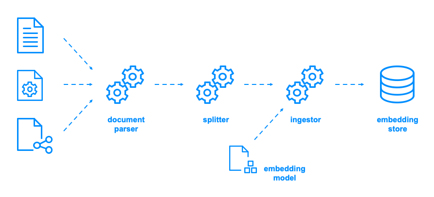

# workshop-langchain4j

Workshop about GenAI-enabled applications powered with Langchain4j.

This workshop was first delivered as a conference talk at OpenSouthCode 2024. Also delivered as a talk at Commif Conf 2025, and in workshop format at OpenSlava 2025.

## Introduction and general instructions

The workshop is structured around several examples of growing complexity. Every example can be run as a simple Java program. To help with trying the integration with Ollama and different local models, there are abstract base classes and then a collection of ready-to-launch examples using the base classes with the different models. This also reinforces how effectively are models decoupled from Java code when using Langchain4j APIs.

The recommended approach is to follow the instructions in this ```README.md``` file, and rely on the solutions available in ```src/main/java``` folder in case of doubts or when stuck in a given step.

## Workshop pre-requisites

Pre-requisites are simple:

- Java 25
- Apache Maven 3.9.11
- Ollama 0.12.2 with any models you want to try
- And, of course, your favorite IDE

The code also works on Java 24 with preview features enabled, with any modern Maven 3.x version, and with any recent Ollama versions (I've been working with Java 24 before 25 was released and with several Maven and Ollama versions in the last few months without impact on the source code).

It is also recommended to download in advance any model that you intend to use. This is recommended to reduce the risk of not being able to download the models during the workshop. Models, even small ones, are big files and bandwidth might be limited if multiple people try to download multi-GB files at the same moment.

Although out of scope for the current workshop content, the repo also has OpenAI and Vertex AI examples that you can try out. Take the following into consideration before running them:

- For OpenAI examples, you need to be a registered paid user. Provide a valid token in environment variable ```OPENAI_API_KEY```.

- For Vertex AI examples, you need to have a Google Cloud account with billing enabled and the necessary permissions to call the APIs. Provide a valid project id in environment variable ```VERTEXAI_PROJECT_ID``` and validate your credentials locally. This guide helped me to do it: [Authenticate to Vertex AI](https://cloud.google.com/vertex-ai/docs/authentication)

## Workshop agenda

This is the agenda for the workshop:

- [workshop-langchain4j](#workshop-langchain4j)
  - [Introduction and general instructions](#introduction-and-general-instructions)
  - [Workshop pre-requisites](#workshop-pre-requisites)
  - [Workshop agenda](#workshop-agenda)
  - [Workshop activities](#workshop-activities)
    - [1. Introduction to Langchain4j and Ollama](#1-introduction-to-langchain4j-and-ollama)
    - [2. A brief guide to model management with Ollama](#2-a-brief-guide-to-model-management-with-ollama)
      - [2.1. Selecting a model for the workshop](#21-selecting-a-model-for-the-workshop)
      - [2.2. Model recommendations for small resource-constrained computers](#22-model-recommendations-for-small-resource-constrained-computers)
      - [2.3. Model recommendations for medium resource-limited computers](#23-model-recommendations-for-medium-resource-limited-computers)
      - [2.4. Model recommendations for more capable computers](#24-model-recommendations-for-more-capable-computers)
    - [3. Langchain4j "Hello World"](#3-langchain4j-hello-world)
    - [4. Managing context (a.k.a. chat memory)](#4-managing-context-aka-chat-memory)
    - [5. Using local models for coding assistance](#5-using-local-models-for-coding-assistance)
    - [6. Implementing RAG (retrieval augmented generation)](#6-implementing-rag-retrieval-augmented-generation)
    - [7. Final words](#7-final-words)

## Workshop activities

### 1. Introduction to Langchain4j and Ollama

I will eventually add the content directly here, but until then you may refer to my slides in previous events:

- [Slides in Spanish from Commit Conf 2025](https://speakerdeck.com/deors/langchain4j-y-ollama-integrando-llms-con-programas-java-at-commit-conf-2025)
- Slides in English from OpenSlava 2026 TBD

### 2. A brief guide to model management with Ollama

Once Ollama is installed, and depending on the chosen binary, you have four main use cases available:

- Use Ollama GUI to download, and use models in a "chatgpt-like" interface. Available as an app for macOs, Linux and Windows here: [Ollama App Download](https://ollama.com/download)
- Use Ollama CLI to download, fine-tune, or create models.
- Use Ollama CLI to run and use a given model in a basic text console interface.
- Use Ollama CLI to run the Ollama server which exposes an API that our programs can use.

The second and fourth use cases are the ones that we will use in this workshop, although you are welcome to experiment with the GUI and the text console as well.

Using Ollama GUI and CLI is quite straightforward, but I will list below the main CLI commands that we will use during this workshop:

- ```ollama pull <model_name:model_variant>```: Downloads a model from Ollama registry. You can search for models here: [Ollama Model Search](https://ollama.com/search)
- ```ollama run <model_name:model_variant>```: Runs the text console interface with the given model loaded.
- ```ollama serve```: Runs the Ollama server. No model is loaded by default, but they will be loaded as the requests are received.
- ```ollama list```: Lists the models downloaded and hence available for ```run``` and ```serve``` commands.
- ```ollama ps```: Lists the models running in the server.
- ```ollama rm <model_name:model_variant>```: Removes the model from the computer.

#### 2.1. Selecting a model for the workshop

Ollama registry has a huge and growing collection of models available. This workshop has no limitations or coupling to specific models, so you are welcomed to try and use whichever you want. We strongly recommend to experiment and compare, as each model has its own strengths and limitations.

However, as this is an approach for local model inference, we have a strong limitation due to the limited resources available in our computers, basically:

- VRAM, that will limit the size of the models that can be loaded and run.
- CPU/GPU capabilities, that will limit what is practically doable (e.g., I've been able to run Qwen Image Edit locally but it took one hour to generate a 1024x1024 image so... can be done but not in a practical way).
- Disk space, as models might be quite large and if you are willing to experiment with multiple models and test the limit of your computer boundaries you can exhaust your available disk space quite fast.

Fortunately, small and middle-sized models in the 2-20 GB range are very capable and more than enough for experimentation, while you have the peace of mind that your solution can scale up to large models.

#### 2.2. Model recommendations for small resource-constrained computers

Some recommendations for you if you have a computer with very limited resources (~8GB VRAM) or without a strong GPU:

- ```qwen3:4b```
- ```deepseek-r1:1.5b```
- ```nemotron-mini:4b```
- ```llama3.2:3b```
- ```gemma3:4b```
- ```phi3:3.8b```

#### 2.3. Model recommendations for medium resource-limited computers

Some recommendations for you if you have a computer with limited resources (~16GB VRAM) and a dedicated GPU:

- ```qwen3:8b``` or ```qwen3:14b```
- ```deepseek-r1:8b``` or ```deepseek-r1:14b```
- ```mistral-nemo:12b```
- ```mistral:7b```
- ```llama3.1:8b```
- ```gemma3:12b```
- ```phi3:14b```

#### 2.4. Model recommendations for more capable computers

Some recommendations for you if you have a capable computer (as per Today's standards, ~32GB VRAM) and a strong dedicated GPU (e.g., NVIDIA RTX or Apple Silicon):

- ```qwen3:30b```
- ```deepseek-r1:32b```
- ```gpt-oss:20b```
- ```mistral-small:22b```

It is also interesting to consider "coding-oriented" models to support in software engineering matters such as code understanding, code generation/refactoring or test code generation/refactoring:

- ```qwen3-coder:30b```
- ```devstral:24b```

A specialized form of "coding-oriented" models are those able to provide in-line completion while creating or editing code, e.g. in the IDE, like for example:

- ```codestral:22b```

### 3. Langchain4j "Hello World"

Let's begin with a very simple program that will simply ask something to an LLM and print the response through the console.

The main interface to guide our work is ```ChatLanguageModel``` from package ```dev.langchain4j.model.chat```. There are multiple implementations depending on the LLM provider, for example:

- ```dev.langchain4j.model.ollama.OllamaChatModel```: For models provided by Ollama.
- ```dev.langchain4j.model.openai.OpenAiChatModel```: For models provided by OpenAI.
- ```dev.langchain4j.model.vertexai.VertexAiGeminiChatModel```: For models provided by Google Vertex AI.
- ```dev.langchain4j.model.azure.AzureOpenAiChatModel```: For models provided by Azure Open AI.

The full list can be explored here: [Langchain4j: Comparison Table of all supported Language Models](https://docs.langchain4j.dev/integrations/language-models/)

To make development and distribution more efficient, all those implementations are bundled in different artifacts. Therefore, depending on which models you intend to use, you will have to add to your ```pom.xml``` (or ```gradle.build```) the right artifacts.

In the case of this workshop activity we are using Ollama with a locally-running model, so we will have to add two artifacts:

- ```dev.langchain4j : langchain4j```: The core of the library.
- ```dev.langchain4j : langchain4j-ollama```: The implementation for Ollama.

```xml
<dependency>
    <groupId>dev.langchain4j</groupId>
    <artifactId>langchain4j</artifactId>
    <version>0.36.2</version>
</dependency>
<dependency>
    <groupId>dev.langchain4j</groupId>
    <artifactId>langchain4j-ollama</artifactId>
    <version>0.36.2</version>
</dependency>
```

At the time of preparing this guide, Langchain4j version was ```0.36.2```.

This is the latest release in the ```0.x``` branch and after it the Langchain4h team has published a partial ```1.0.0``` release. Since then, a number of releases have been published but the whole project is still not available in these ```1.x``` releases including the latest which is ```1.7.1```. Therefore, to give you a stable experience during the workshop, we will stick to ```0.36.2```. If you want to try with a newer version you are welcomed but be warned that some version tweaking and breaking changes may occur.

With those preparations done, it's time to code the very first "Hello World" program with Langchain4j. Please note that the model that I'm using can be any other but take a look to those recommended in [Section 2](#2-a-brief-guide-to-model-management-with-ollama).

```java
import dev.langchain4j.model.chat.ChatLanguageModel;
import dev.langchain4j.model.ollama.OllamaChatModel;

class OllamaGptOssHelloWorld {

    void main() {
        // gpt-oss:20b model running locally with Ollama
        ChatLanguageModel model = OllamaChatModel.builder()
            .baseUrl("http://localhost:11434")
            .modelName("gpt-oss:20b")
            .build();

        // the first prompt
        String message = "Hello world!";
        System.out.println("\n>>> " + message);

        String answer = model.generate(message);
        System.out.println(answer);
    }
}
```

To test it, just run the class in the IDE or through the command line and, if Ollama is running and serving the chosen model, you will see something similar to this:

```text
>>> Hello world!
Hello! How can I help you today?
```

### 4. Managing context (a.k.a. chat memory)

When working with LLMs there are basically two kinds of memory: short-term and long-term memory. For the sake of simplicity and timing, in this workshop we will explore only the most common and simple type: the short-term memory.

Short-term memory is interchanged between the client and the server as part of the context. Older messages (questions and answers, files), are sequentially included in the JSON struct of the request. This is called short-term memory because it 'dies' when the client finishes the session or removes the data from its memory (or local storage).

In Langchain4j, chat memory is abstracted with the ```dev.langchain4j.memory.ChatMemory``` interface, and "in-memory" short-term memory is implemented by the class ```dev.langchain4j.memory.chat.MessageWindowChatMemory```. To create a limited memory for up to 10 messages you can use this:

```java
ChatMemory chatMemory = MessageWindowChatMemory.withMaxMessages(10);
```

Keep adding questions and answers to the memory. Every question must be composed with the ```dev.langchain4j.data.message.UserMessage.userMessage``` static function. Every new answer received is abstracted with the ```dev.langchain4j.data.message.ChatMessage``` interface. To generate a request to the server ensuring that all previous context is passed, compose the message from the chat memory:

```java
chatMemory.add(userMessage(question));
ChatMemory answer = model.generate(chatMemory.messages()).content();
chatMemory.add(answer);
```

### 5. Using local models for coding assistance

There is nothing special to use Ollama and local models for asking questions about code or to generate code. Just keep asking (there are some suggestions in the example code).

For in-line completion there are specific models that can work with certain tokens to be used to signal when a block of code starts, the cursor point, and the end of the code block.

For example, Codestral uses these tokens:

```java
[PREFIX]import java.time.LocalDate;
import java.time.Period;

class AgeCalculator {
    static int calculateAge(LocalDate birthDate, LocalDate currentDate) {
        if (birthDate != null && currentDate != null) {
            [SUFFIX]
        } else {
            return 0;
        }
    }
}[MIDDLE]
```

which will return something like this:

```java
return Period.between(birthDate, currentDate).getYears();
```

### 6. Implementing RAG (retrieval augmented generation)

In this activity we will implemented a basic, in-memory, retrieval augmented generation (RAG) feature to enrich the chat context. RAG technique is a very simple and cost-effective way to have our agents and assistants "better prepared" for their assigned tasks, as compared with training your own models or fine-tuning existing ones.

With RAG, before a question or request is sent to the LLM, the flow would look for relevant pieces of information stored in a knowledge base (typically, a document-oriented database with vector search or a graph database), and add them into the context.

RAG can be seen as a form of long-term memory -- one that is usually populated before the agent or assistant is GA to end users, but is suitable for continuous use as knowledge base sources are not read-only.

This is the high-level flow of creating embeddings to populate the knowledge base:



- Document parsers know how to convert document formats to plain text, e.g. from PDF, RTF, ODF, Open XML, etc.
- Splitters know how to extract tokens from words and symbols. If you remember from "LLM 101", a token is not a word, rather is close to a portion of meaning, so typically words will have more than one token. No worries -- splitters know how to do that.
- Ingestors, complemented by an embedding model, know how to convert the tokens into meaningful vectors of related information, and prepare data in a way that can be stored in the final embedding store.

As commented just above, for the sake of simplicity and time, we will just use an in-memory embedding and retrieval flow. The key pieces to create the embeddings are:

- ```dev.langchain4j.model.embedding.onnx.allminilml6v2.AllMiniLmL6V2EmbeddingModel```: The embedding model to be used, good for simple documents. You need to add ```dev.langchain4j : langchain4j-embeddings-all-minilm-l6-v2``` to your ```pom.xml``` file.
- ```dev.langchain4j.data.document.parser.apache.tika.ApacheTikaDocumentParser```: Probably, the reference library for parsing documents of multiple, commonly used types. You need to add ```dev.langchain4j : langchain4j-document-parser-apache-tika``` to your ```pom.xml``` file. WARNING: There is an incompatibility with declared ```commons-io : commons-io``` dependencies. If you find any issues related with that, exclude the transitive dependency introduce by Tika module, and add the dependency explicitly in the ```pom.xml```. If you don't feel specially adventurous, just look at the source in the workshop repository.
- ```dev.langchain4j.data.document.DocumentSplitter```: The document splitter.
- ```dev.langchain4j.store.embedding.EmbeddingStoreIngestor```: The embedding ingestor.
- ```dev.langchain4j.store.embedding.inmemory.InMemoryEmbeddingStore```: The in-memory embedding store, as good as the local memory you have.

The process above needs to be done just once (or many times if you keep enriching the knowledge base). Afterwards, we can retrieve the relevant pieces of information when needed during AI agent execution time.

Given a chat model and chat memory as in previous activities, prepare the content retriever provided by ```dev.langchain4j.rag.content.retriever.EmbeddingStoreContentRetriever``` class, and build an agent with ```dev.langchain4j.service.AiServices``` class:

```java
ChatLanguageModel chatModel = ...
ChatMemory chatMemory = ...

ContentRetriever retriever = EmbeddingStoreContentRetriever.builder()
    .embeddingModel(embModel)
    .embeddingStore(embStore)
    .maxResults(1)
    .minScore(0.8)
    .build();

Agent agent = AiServices.builder(Agent.class)
    .chatLanguageModel(chatModel)
    .chatMemory(chatMemory)
    .contentRetriever(retriever)
    .build();

String answer = agent.answer(question);
```

```Agent``` is just a simple interface that ```AiServices``` will leverage as a template to build up the agent with the desired chat model, chat memory and content retriever:

```java
interface Agent {
    @SystemMessage("""
        You are an expert in information technologies and software engineering.
        """)
    String answer(String inputMessage);
```

### 7. Final words

Just attend the live presentation.
